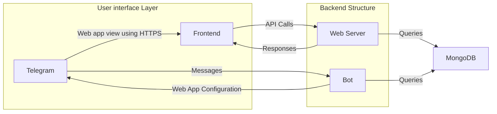

# Telegram Bot

<table>
  <tr>
    <td align="center" style="padding:0 15px">
      
    </td>
    <td align="center" style="padding:0 15px">
      
    </td>
  </tr>
</table>


|  |  |
|----------------------------------------------------|----------------------------------------------------|


<div align="left">
    
</div>

<div align="right">
    
</div>


dark & light

<!-- ABOUT THE PROJECT -->

## About the Project
This project is a mini application built for Telegram. It consists of a backend and a frontend, both of which are containerized using Docker for easy deployment and scalability.

The backend is built with Node.js and Express, and it uses MongoDB for data storage. It handles Telegram bot functionalities, manages game states, and processes transactions. The backend also provides an API for the frontend to interact with, and it uses Swagger for API documentation.

The frontend is built with React and Chakra UI. It provides a user interface for playing games and managing user wallets. The frontend communicates with the backend through API calls, and it uses Telegram's OAuth for user authentication.

The project uses GitHub Actions for continuous integration and deployment. The backend is deployed to a custom Linux server, and the frontend is deployed to GitHub Pages.

_insert vid like cal_

### Overview
This project was created as a solution for the project launched by Telegram. 

You can [test the bot here](https://t.me/TheVegasBot)

Read more about the [`Telegram contest`](https://t.me/contest/327)

<!-- GETTING STARTED -->

## Getting Started

### Prerequisites
- Node.js (Version: >=16.x)
- npm
- Docker
- MongoDB

Read on the deployment section more information about our setup.

_list any prerequisites or dependencies that users need to have installed on their machines_

## Development

### Setup 

1. Clone the repo into a public GitHub repository (or fork https://github.com/Fardenz/telegram-mini-app/fork).

    ```sh
   git clone https://github.com/Fardenz/telegram-mini-app.git
   ```
    
   > If you are on Windows, run the following command on `gitbash` with admin privileges: <br> > `git clone -c core.symlinks=true https://github.com/Fardenz/telegram-mini-app` <br>

2. Set up Frontend [here](https://github.com/Fardenz/telegram-mini-app/blob/main/frontend/README.md)
3. Set up the Backend [here](https://github.com/Fardenz/telegram-mini-app/blob/main/backend/README.md). 


## Solution Overview

### Swagger API Documentation 

For our current project, we have integrated the [`Swagger API documentation`](https://en.wikipedia.org/wiki/Swagger_(software)) to provide detailed information about all the endpoints supported by our API. This makes it easier for developers to understand the available functionality and test the API.

You can access the Swagger API documentation [here](https://13db-79-137-37-91.ngrok-free.app/api-documentation-ui/). This interactive documentation provides a comprehensive overview of the API endpoints, their input parameters, expected responses, and any required authentication.

We also use this Swagger specification to validate all the requests and responses that the bot receives. This ensures that the data is in the correct format and structure before being processed by the backend.

Please note that the Swagger API documentation will be regularly updated as new features are added or existing ones are modified in the project. Therefore, it is essential to refer to the latest version of the documentation to stay up to date with the API's capabilities.

### Deployment

#### Database
We're using [`MongoDB Atlas`](https://www.mongodb.com/atlas/database) to host our database. In our case it's free and allows us to scale easily.

#### GitHub Actions

We're using Github Actions as our CI/CD tool. You can find the configuration in `.github/workflows/`, whenever a push is made to the `main` branch, the workflow will be triggered, deploying the latest code.

<details>
<summary>Backend</summary>
The backend is automatically deployed to a custom server owned by us running Linux. We use docker to package the code so it's easier to spin multiple copies, isolate instances and deploy the minimum amount of code.

You can set your custom secrets in the repository settings and it will automatically deploy to your server. The secrets are:

```
SSH_HOST
SSH_PRIVATE_KEY
SSH_USERNAME
ENV_VARIABLES
```

You can find the configuration in `.github/workflows/staging-deployment-backend.yml`
</details>

<details>
<summary>Frontend</summary>
We're using Github Pages to deploy the frontend, this allows us to have a public URL with HTTPS for the web app without having to pay for a server. The disadvantage is that you can only host static webpages. To deploy it automatically configure your github pages in the repository settings and set the `ENV_VARIABLES_FRONTEND` secret.

You can find the configuration in `.github/workflows/staging-deployment-frontend.yml`
</details>

### Architecture



### Code Structure (_explain the organization of your code, detailing the purpose of each major component or module_)

#### Backend
https://github.com/Fardenz/telegram-mini-app/blob/main/backend/README.md#Code-Structure
      
#### Frontend
https://github.com/Fardenz/telegram-mini-app/blob/main/frontend/README.md#Code-Structure

## Error Handling

### Common Errors
_list potential errors that users may encounter and explain how to troubleshoot them_

Most of the expected requests will be on the Swagger file, so you can test them there. If you are using Postman, you can import the Swagger file and use the requests from there.

<details>
<summary>Requests stated in Swagger are not working correctly</summary>
Ensure that you have the correct URL in the `.env` file. The URL should be the same as the one you used to expose your backend to the internet. Also make sure that the protocol is the correct one, so `http` for local.

</details>

<details>
<summary>Web app is only accessible through Telegram by https and in a public url</summary>
You will have to use a service like ngrok or localtunnel to expose your local web app to the internet. Then, you will have to change the `TELEGRAM_FRONTEND` variable in the `.env` file to the URL provided by the service. Make sure that the protocol is the correct one, so `https` for ngrok.
</details>

<details>
<summary>Invalid input or parameters when making requests</summary>
If you encounter errors related to invalid input or parameters when making requests, consider the following troubleshooting steps:
- Check the error returned by the backend, it's usually explicitly telling you what's wrong.
- Double-check the format and structure of the data being sent with each request. 
- Ensure that it matches the expected format specified by the API endpoints.
- Verify that you are providing all the required parameters for each request. 
- Check the API documentation or Swagger file to ensure that you are including all the necessary parameters.
- Validate the user input on the client side before making the request to prevent invalid data from being sent.

</details>

## 🛣️ Roadmap

### 🚀 **Initial Phase**
- [ ] 🔍 **Investigate Crypto Integration**
  - Explore possibilities of integrating with @wallet for crypto top-up and withdrawal.

### 🌍 **Localization & User Experience**
- [ ] Add support for more languages.
- [ ] 🔧 Improve error handling and logging for a smoother user experience.

### 🎮 **Feature Enhancements**
- [ ] Add more games to the web app.
- [ ] 🤖 Enhance bot commands to be more user-friendly.

### 🧪 **Quality Assurance**
- [ ] Implement comprehensive tests to ensure stability and reliability.


